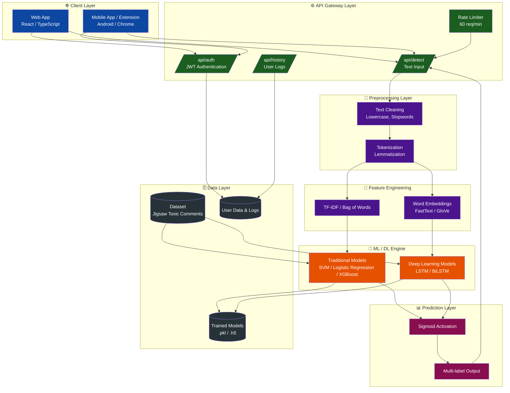
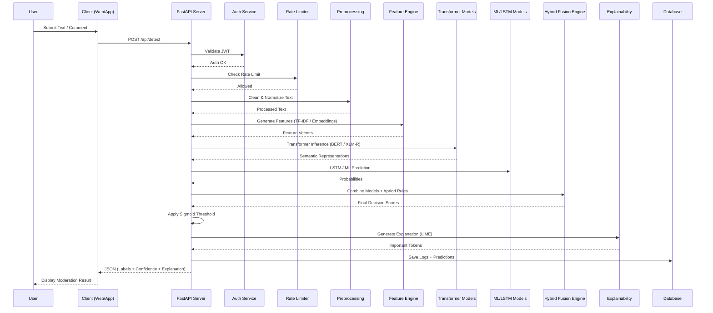

<div align="center">

[](https://github.com/oyyPoodles/ToxiClass-Multi-Label-NLP-Based-Moderation-Engine/graphs/contributors)
[](https://github.com/oyyPoodles/ToxiClass-Multi-Label-NLP-Based-Moderation-Engine/network/members)
[](https://github.com/oyyPoodles/ToxiClass-Multi-Label-NLP-Based-Moderation-Engine/stargazers)
[](https://github.com/oyyPoodles/ToxiClass-Multi-Label-NLP-Based-Moderation-Engine/issues)
[](https://github.com/oyyPoodles/ToxiClass-Multi-Label-NLP-Based-Moderation-Engine/blob/main/LICENSE)
[](https://www.linkedin.com/)

# ToxiShield AI: Advanced Multi-Label NLP Moderation Engine

</div>

> **Author**: Ujjwal Chaudhary

## 📌 1. Project Overview
**ToxiShield AI** is a fully scalable, research-ready, and industry-grade AI moderation platform. Evolving from a fundamental machine learning framework, this system has been upgraded into a robust **multi-label classification** engine capable of intelligently identifying, explaining, and mitigating hate speech across online platforms in real time. It combines state-of-the-art transformer architectures with hybrid intelligent systems to achieve unprecedented accuracy in conversational behavior moderation.

## 🚨 2. Problem Statement
With the rapid integration of global digital communities, platforms face immense challenges regarding toxic behavior, cyberbullying, and hate speech. Manual moderation fails at scale, leading to hostile digital environments. Automated moderation systems historically struggled with understanding nuanced contexts, capturing multilingual slang, and providing unbiased resolutions. **ToxiShield AI** directly addresses these critical issues by leveraging sophisticated deep contextual representations, explainable AI, and fairness protocols to foster safe, engaging, and welcoming online communities.

## 🎯 3. System Objectives
- **Contextual Awareness**: Transcend simple keyword filtering to understand genuine intent and conversational flow.
- **Fairness & Explainability**: Ensure transparent moderations devoid of inherent algorithmic bias.
- **Scalability**: Seamlessly integrate with massive production pipelines maintaining high throughput via asynchronous REST APIs.
- **Multilingual Support**: Identify local expressions and language nuances dynamically.

## ✨ 4. Key Features
- **Transformer-Based Models**: Utilization of bleeding-edge architectures including BERT, RoBERTa, and DistilBERT for vast semantic embeddings.
- **Context-Aware Detection**: Evaluates conversation history through an advanced context buffer, successfully mitigating sarcasm ambiguity.
- **Explainable AI (XAI)**: Visualizes model predictions using SHAP and LIME, mapping exact toxic triggers within sentences.
- **Bias & Fairness Module**: Detects and accounts for sociodemographic skewing, employing advanced fairness metrics to secure neutral interpretations.
- **Multilingual Support**: Inherently supports diverse languages including Hindi, Tamil, and Hinglish via XLM-R.
- **Data Engineering Enhancements**: Automated text augmentation through back-translation and synonym replacement for increased model robustness.

## 🏗️ 5. System Architecture
Our advanced pipeline seamlessly handles data ingestion, hybrid processing, and secure feedback moderation.



### End-to-End Workflow Sequence


## 📊 6. Dataset Description
The system draws from a diversified corpus natively extracted from **Conversation AI**.
- **Total Training Records**: 159,571
- **Total Testing Records**: 153,164
- Features applied with strategic **Data Augmentation** techniques to generate resilient, unbiased samples representing multiple dialects.

### Toxicity Class Support
- **Toxic**: 15,294
- **Obscene**: 8,449
- **Insult**: 7,877
- **Severe Toxic**: 1,595
- **Identity Hate**: 1,405
- **Threat**: 478

## 🔬 7. Methodology
1. **Intelligent Ingestion**: Contextual data is parsed while retaining conversational history buffers.
2. **Text Standardization**: Aggressive noise reduction processes strip unnecessary metadata, isolating linguistic intent.
3. **Embeddings & Contextual Encoders**: Sentences are transformed using global text representations (FastText/GloVe) and bidirectional attention masks (Transformers).
4. **Prediction Alignment**: An ensemble layer aggregates predictions, cross-checking findings with localized Apriori threshold associations.

## 🤖 8. Models Used
The framework executes a tiered modeling approach to balance speed and accuracy:
- **Traditional Algorithms**: Naive Bayes, Support Vector Machines, Logistic Regression, XGBoost, Extra Trees, Apriori.
- **Recurrent Architectures**: LSTMs optimized with zero-shot, GloVe, Word2Vec, and FastText modalities.
- **Transformer Networks**: DistilBERT for rapid inferences; RoBERTa and mBERT/XLM-R for dense, multilingual precision.

## 🔗 9. Hybrid System Explanation
No single algorithm perfectly captures semantic toxicity. ToxiShield AI integrates a **Hybrid Fusion Layer** that merges the lightning-fast probabilistic classifications of Traditional ML, the sequence memory patterns of LSTMs, and the deep contextual brilliance of Transformers. A weighted consensus system determines the final categorical probabilities, effectively countering individual model blindspots.

## 🕵️ 10. Explainability & Fairness
To maintain compliance and trust, ToxiShield AI acts as a transparent box.
- **SHAP & LIME**: Highlights exact offending clauses and toxic root words influencing the model.
- **Fairness Metrics**: Routinely calibrates outputs against demographic parity scores to ensure historically marginalized dialects are not incorrectly penalized as toxic.

## 📈 11. Results & Evaluation 
Evaluated on heavy class-imbalanced partitions using strictly defined accuracy and comprehensive metrics including Precision, Recall, and per-class F1-scores.

| Algorithm (Model) | Accuracy (Mean AUC-ROC) |
| :--- | :--- |
| **RoBERTa / BERT (Transformers)** | **0.989** |
| LSTM without pretrained embeddings | 0.970 |
| Naive Bayes | 0.970 |
| XGBoost | 0.960 |
| LSTM with FastText embedding | 0.960 |
| Extra Trees | 0.930 |
| Logistic Regression (Classifier Chains) | 0.760 |

## 📁 12. Core AI Structure
```text
📦 ToxiShield-AI
 ┣ 📂 notebooks/
 ┃ ┣ 📜 BERT_RoBERTa.ipynb
 ┃ ┣ 📜 LSTM_Architectures.ipynb
 ┃ ┣ 📜 Traditional_ML.ipynb
 ┃ ┗ 📜 XAI_Fairness_Evaluation.ipynb
 ┣ 📂 src/
 ┃ ┣ 📂 models/ (Transformer Architectures)
 ┃ ┗ 📂 core/ (Hybrid Engine, XAI, Context & Preprocessing)
 ┣ 📜 README.md
 ┗ 📜 dataset/ (GitIgnored Core Extracts)
```

## 🚀 14. Future Enhancements
- Visual & Audio Toxicity Analysis natively extending to meme and voice-clip moderation.
- Federated Learning protocols keeping localized platform data perpetually encrypted.
- Zero-Shot prompt-tuning optimizations using Large Language Models (LLMs).

## ✅ 15. Conclusion
**ToxiShield AI** fundamentally redefines text-based moderation frameworks. Transitioning from a simplistic academic iteration into a production-grade, globally scalable API, it integrates cutting-edge Transformer technology, unbiased evaluation metrics, and transparent explainability layers ensuring the future of human connectivity remains bright, inclusive, and respectfully engaging.
